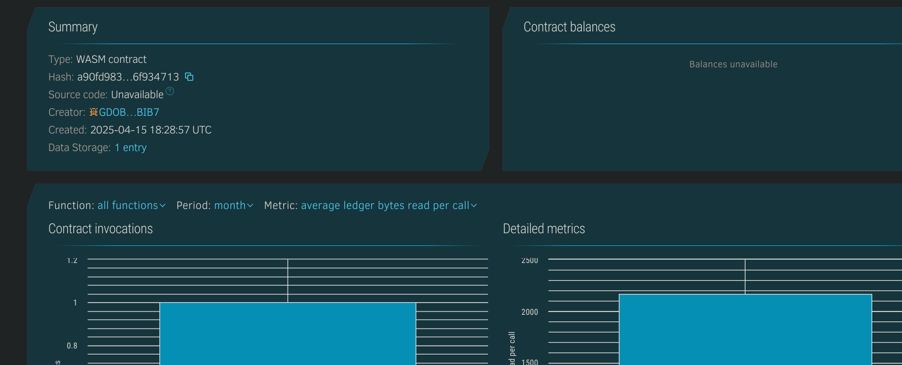

# Blockchain - *Resume Project*

## Project Description -
A decentralized resume system that stores professional information like skills, experience, and education on-chain using the Soroban smart contract platform. Each resume is tied to a unique blockchain address.

## Project Vision -
To empower individuals with full ownership and control over their professional profiles while enabling transparent, verifiable resumes for hiring and collaborations.

## Key Features -
- 👤 **Owner-Tied Resumes:** Each resume is associated with a wallet address.
- 📜 **Structured Resume Data:** Includes name, headline, skills, experience, and education.
- 🕒 **Timestamped Records:** Resumes are stored with a blockchain timestamp for authenticity.
- 🔍 **Public Viewability:** Resumes can be fetched using the owner’s address.

## Future Scope -
- 📝 Enable updates to resume data with versioning.
- ✅ Add third-party endorsement and verification mechanisms.
- 📎 Attach project portfolios and certifications via IPFS.
- 🧩 Integrate with hiring platforms and LinkedIn-style dApps.

## Contract Details - 
GDG72TLZGJ4CGQXU4OVXJ3UK34V5G5JKT3BQKZETLNPQYBTU4XYP4KC2

